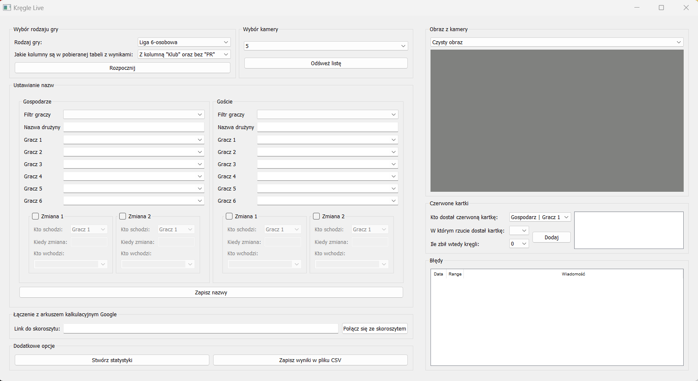
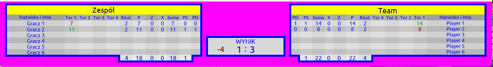
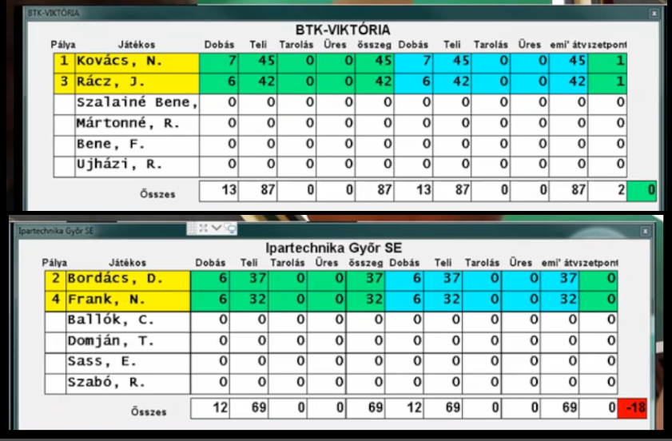

# Kręgle Live

- Python 3.10
- Program na Windows

Program został napisany, aby uatrakcyjnić transmisję live z meczów kręglarskich. Aplikacja przetwarza obraz z monitora z wynikami meczu (obraz można pobierać poprzez Grabber HDMI), następnie tworzy tabelki z wynikami, które można dodać do transmisji poprzez OBS. Dodatkowo program ma możliwość zapisywania wyników z zawodów w arkuszu kalkulacyjnym Google. Po zakończeniu meczu program generuje podsumowanie i pokazuje najciekawsze statystyki.

# Wygnąd programu
### Wygląd programu

### Tworzona przez program tabelka z wynikami drużyny
 

### Tworzona przez program tabelka z wynikami aktualnie grających graczy

### Ekran z wynikami, z którego program pobiera dane
